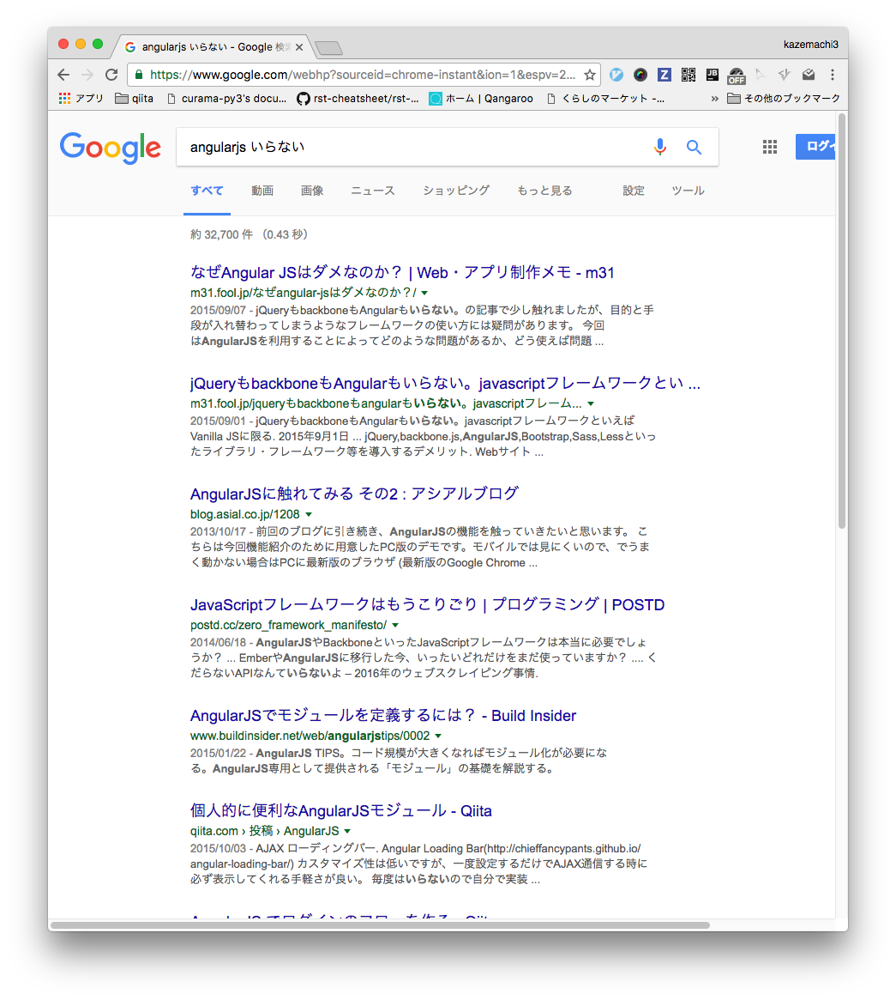
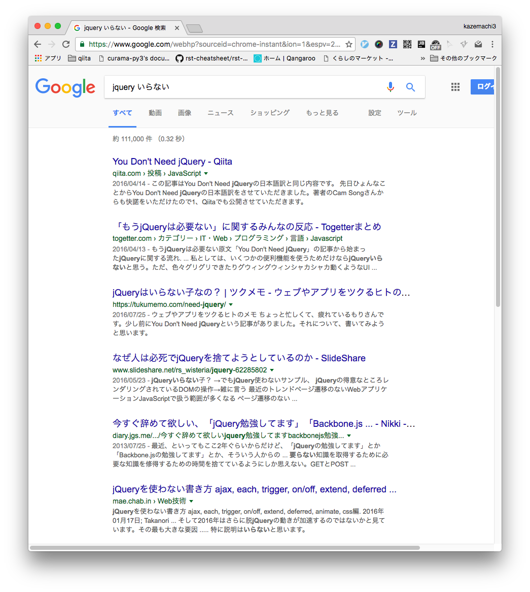

# jQueryと何か

--

> jQueryは高速で、小規模で、機能豊富なJavaScriptライブラリです。これは、HTML文書のトラバースと操作、イベント処理、アニメーション、Ajaxなどの機能を、多数のブラウザで動作する使いやすいAPIによって非常に簡単にします。汎用性と拡張性の組み合わせにより、jQueryは何百万人もの人々がJavaScriptを書く方法を変えました。

https://jquery.com/

--

jQueryのinitial releaseは2006年

> いろいろな効果を追加できるJavaScriptライブラリ「jQuery」
http://gigazine.net/news/20060706_jquery/

10年選手

---

# 2016年、
# jQueryの状況

--
* "angularjs いらない"
</img>

--
* "jquery いらない"
</img>

--
111,000件

DISられがち

---

# なぜDISられるか

--

### 他フレームワークの台頭

Angular.js, vue.js, react.js...

--

### JavaScript本体の高機能化
#### セレクタ使える
```js
document.querySelector(".hoge");
document.querySelectorAll(".hoge");
```
#### ES2015
ただし、ブラウザ対応はまだまだ

--

> 幸か不幸かわからないが、jQueryの活躍する余地はまだある…

by @hiro-hori

---

# jQueryコードを書くときに気をつけてほしいこと

--

間違いだらけのコード

```html
<p>ほげほげ〜</p>
<script src="//code.jquery.com/jquery-3.1.1.min.js"></script>
<script>
    p = $("p:first");
    p.css("background-color", "red");
</script>
```

--
間違いだらけのコード

```html
<p>ほげほげ〜</p>
<script src="//code.jquery.com/jquery-3.1.1.min.js"></script>
<script>
    message = $("p:first");
    message.css("background-color", "red");
</script>
```

* `$(function() {});`で包む
* HTMLに依存しない/スタイルつけようとか思わない
* そして`"use strict";`がほしい
--
#### `$(function() {});`で包む
```html
<p>ほげほげ〜</p>
<script src="//code.jquery.com/jquery-3.1.1.min.js"></script>
<script>
    $(function() {
        message = $("p:first");
        message.css("background-color", "red");
    });
</script>
```
* $(document).ready()のショートハンド
* DOM構築が完了したら点火される
Note: (window.loadとかいろんな準備完了っぽいイベントがあるけど、とりあえずこれだけ覚えておけば良い)
--
#### HTMLに依存しない/スタイルつけようとか思わない
before
```html
<p>ほげほげ〜</p>
<script src="//code.jquery.com/jquery-3.1.1.min.js"></script>
<script>
    $(function() {
        message = $("p:first");
        message.css("background-color", "red");
    });
</script>
```
--
#### HTMLに依存しない/スタイルつけようとか思わない
HTML
```html
<p id="js-message">ほげほげ〜</p>
<script src="//code.jquery.com/jquery-3.1.1.min.js"></script>
<script>
    $(function() {
        message = $("#js-message");
        message.addClass("message");
    });
</script>
```
css
```css
.message {
    background-color: "red";
}
```
* HTMLは文章の構造を規定する
* CSSは文章のスタイルを規定する
* JSはそれらに依存しちゃいけないし、それらの領域に手を出すべきでない
Note: （なんでもできるけど）
--
#### そして`"use strict";`がほしい
```html
<p id="js-message">ほげほげ〜</p>
<script src="//code.jquery.com/jquery-3.1.1.min.js"></script>
<script>
    "use strict";
    $(function() {
        var $message = $("#js-message");
        $message.addClass("message");
    });
</script>
```
* strictモードで動作させる
* `var`のつけ忘れでたやすくグローバル変数が作れる

Note: jQueryじゃないけど・jQueryオブジェクトを格納してる変数にはprefix`$`をつけたい
---

実演

---

ありがとうございました
